# System Architecture Analysis

## Overview

- **Project**: /home/tom/github/semcod/codot/godot
- **Primary Language**: shell
- **Languages**: shell: 10, json: 6, go: 5, md: 3, yaml: 2
- **Analysis Mode**: static
- **Total Functions**: 88
- **Total Classes**: 22
- **Modules**: 34
- **Entry Points**: 60

## Architecture by Module

### llm.app
- **Functions**: 38
- **Classes**: 6
- **File**: `app.py`

### README
- **Functions**: 24
- **Classes**: 10
- **File**: `README.md`

### src.deploy_workflow
- **Functions**: 9
- **Classes**: 3
- **File**: `deploy_workflow.go`

### scripts.validate-bundle
- **Functions**: 8
- **File**: `validate-bundle.sh`

### scripts.test-llm
- **Functions**: 6
- **File**: `test-llm.sh`

### src.bundle_test
- **Functions**: 6
- **File**: `bundle_test.go`

### src.bundle
- **Functions**: 6
- **Classes**: 3
- **File**: `bundle.go`

### generated.dashboard
- **Functions**: 2
- **File**: `dashboard.php`

### scripts.test-services
- **Functions**: 2
- **File**: `test-services.sh`

### src.starter
- **Functions**: 2
- **Classes**: 1
- **File**: `starter.go`

### src.structs
- **Functions**: 0
- **Classes**: 4
- **File**: `structs.go`

## Key Entry Points

Main execution flows into the system:

### src.starter.main
- **Calls**: src.starter.len, src.starter.Fprintln, src.starter.Exit, src.starter.ReadFile, src.starter.Fatalf, src.starter.byte, src.starter.Unmarshal, src.starter.Printf

### llm.app.ACLPolicy.from_file
- **Calls**: cls, path.exists, cls, yaml.safe_load, path.read_text, list, list, list

### llm.app.ACLPolicy.allows
- **Calls**: urlparse, parsed.scheme.lower, self._matches_any, self._matches_any, None.resolve, self._matches_any, llm.app.is_private_host, Path

### src.bundle.Run
- **Calls**: src.bundle.func, src.bundle.validate, src.bundle.Getenv, src.bundle.LoadSchema, src.bundle.Printf, src.bundle.failed, src.bundle.Errorf, src.bundle.runGoTemporal

### src.deploy_workflow.main
- **Calls**: src.deploy_workflow.Dial, src.deploy_workflow.Fatalln, src.deploy_workflow.Close, src.deploy_workflow.New, src.deploy_workflow.RegisterWorkflow, src.deploy_workflow.RegisterActivity, src.deploy_workflow.Run, src.deploy_workflow.InterruptCh

### llm.app.list_bundles
- **Calls**: main_app.get, sorted, target_dir.exists, len, str, path.relative_to, target_dir.rglob, path.is_file

### generated.dashboard.updateData
- **Calls**: generated.dashboard.fetch, generated.dashboard.then, generated.dashboard.json, generated.dashboard.getElementById, generated.dashboard.stringify, generated.dashboard.setTimeout

### src.bundle_test.TestBundleSchemaValidation
- **Calls**: src.bundle_test.collectBundleFiles, src.bundle_test.Fatalf, src.bundle_test.Run, src.bundle_test.Base, src.bundle_test.func, src.bundle_test.validateBundleData

### llm.app.build_state
- **Calls**: Settings, json.loads, Draft202012Validator, ACLPolicy.from_file, AppState, settings.schema_file.read_text

### src.bundle_test.TestOutputValidation
- **Calls**: src.bundle_test.Marshal, src.bundle_test.Fatalf, src.bundle_test.Unmarshal, src.bundle_test.Errorf, src.bundle_test.Error

### src.bundle_test.TestBundleUnmarshal
- **Calls**: src.bundle_test.Unmarshal, src.bundle_test.byte, src.bundle_test.Fatalf, src.bundle_test.Errorf, src.bundle_test.len

### generated.dashboard.fetchData
- **Calls**: generated.dashboard.curl_init, generated.dashboard.curl_setopt, generated.dashboard.json_decode, generated.dashboard.curl_exec

### src.bundle_test.TestSourceValidation
- **Calls**: src.bundle_test.Marshal, src.bundle_test.Fatalf, src.bundle_test.Unmarshal, src.bundle_test.Errorf

### llm.app.generate_bundles
- **Calls**: main_app.post, results.append, len, llm.app.generate_bundle

### llm.app.env_bool
- **Calls**: os.getenv, None.lower, value.strip

### llm.app.env_int
- **Calls**: os.getenv, int, value.strip

### llm.app.env_float
- **Calls**: os.getenv, float, value.strip

### llm.app.fetch_context
- **Calls**: main_app.post, len, llm.app.fetch_many

### src.deploy_workflow.HealthcheckActivity
- **Calls**: src.deploy_workflow.Get, src.deploy_workflow.Errorf

### llm.app.health
- **Calls**: main_app.get, str

### llm.app.describe_acl
- **Calls**: main_app.get, STATE.acl.describe

### llm.app.fetch_single
- **Calls**: main_app.post, llm.app.fetch_uri

### src.deploy_workflow.DeployServiceBundle
- **Calls**: src.deploy_workflow.DeployViewBundle

### src.deploy_workflow.DeployWorkflowBundle
- **Calls**: src.deploy_workflow.DeployViewBundle

### src.deploy_workflow.DeployApplicationBundle
- **Calls**: src.deploy_workflow.DeployViewBundle

### src.deploy_workflow.DeployServiceActivity
- **Calls**: src.deploy_workflow.Sprintf

### llm.app.ACLPolicy._matches_any
- **Calls**: fnmatch.fnmatch

### llm.app.ACLPolicy.describe
- **Calls**: str

### llm.app.mock_health
- **Calls**: mock_app.get

### llm.app.mock_devices
- **Calls**: mock_app.get

## Process Flows

Key execution flows identified:

### Flow 1: main
```
main [src.starter]
```

### Flow 2: from_file
```
from_file [llm.app.ACLPolicy]
```

### Flow 3: allows
```
allows [llm.app.ACLPolicy]
```

### Flow 4: Run
```
Run [src.bundle]
```

### Flow 5: list_bundles
```
list_bundles [llm.app]
```

### Flow 6: updateData
```
updateData [generated.dashboard]
```

### Flow 7: TestBundleSchemaValidation
```
TestBundleSchemaValidation [src.bundle_test]
  └─> collectBundleFiles
```

### Flow 8: build_state
```
build_state [llm.app]
```

### Flow 9: TestOutputValidation
```
TestOutputValidation [src.bundle_test]
```

### Flow 10: TestBundleUnmarshal
```
TestBundleUnmarshal [src.bundle_test]
```

## Key Classes

### llm.app.ACLPolicy
- **Methods**: 4
- **Key Methods**: llm.app.ACLPolicy.from_file, llm.app.ACLPolicy._matches_any, llm.app.ACLPolicy.allows, llm.app.ACLPolicy.describe

### README.Bundle
- **Methods**: 0

### README.Source
- **Methods**: 0

### README.Output
- **Methods**: 0

### README.ViewBundle
- **Methods**: 0

### README.Template
- **Methods**: 0

### src.starter.bundleMetadata
- **Methods**: 0

### src.structs.ViewBundle
- **Methods**: 0

### src.structs.Source
- **Methods**: 0

### src.structs.Template
- **Methods**: 0

### src.structs.Output
- **Methods**: 0

### src.bundle.Bundle
- **Methods**: 0

### src.bundle.Source
- **Methods**: 0

### src.bundle.Output
- **Methods**: 0

### src.deploy_workflow.Bundle
- **Methods**: 0

### src.deploy_workflow.Source
- **Methods**: 0

### src.deploy_workflow.Output
- **Methods**: 0

### llm.app.Settings
- **Methods**: 0

### llm.app.FetchRequest
- **Methods**: 0
- **Inherits**: BaseModel

### llm.app.FetchManyRequest
- **Methods**: 0
- **Inherits**: BaseModel

## Data Transformation Functions

Key functions that process and transform data:

### README.validateBundleData

### src.bundle_test.validateBundleData
- **Output to**: src.bundle_test.Helper, src.bundle_test.ReadFile, src.bundle_test.Fatalf, src.bundle_test.Unmarshal, src.bundle_test.Error

### llm.app.infer_output_format
- **Output to**: prompt.lower, None.intersection, None.intersection

### llm.app.validate_bundle
- **Output to**: sorted, STATE.validator.iter_errors, HTTPException, None.join, details.append

## Behavioral Patterns

### recursion_compact
- **Type**: recursion
- **Confidence**: 0.90
- **Functions**: llm.app.compact

## Public API Surface

Functions exposed as public API (no underscore prefix):

- `llm.app.fetch_uri` - 25 calls
- `src.starter.main` - 18 calls
- `llm.app.ACLPolicy.from_file` - 15 calls
- `llm.app.ACLPolicy.allows` - 12 calls
- `llm.app.build_bundle_from_prompt` - 12 calls
- `src.bundle.LoadSchema` - 9 calls
- `src.bundle.Run` - 9 calls
- `src.bundle.runGoTemporal` - 9 calls
- `src.bundle_test.validateBundleData` - 8 calls
- `src.deploy_workflow.main` - 8 calls
- `llm.app.list_bundles` - 8 calls
- `llm.app.maybe_refine_bundle` - 7 calls
- `llm.app.validate_bundle` - 7 calls
- `generated.dashboard.updateData` - 6 calls
- `src.bundle_test.collectBundleFiles` - 6 calls
- `src.bundle_test.TestBundleSchemaValidation` - 6 calls
- `src.bundle.fetchSchema` - 6 calls
- `llm.app.build_state` - 6 calls
- `llm.app.source_name_from_uri` - 6 calls
- `src.bundle_test.TestOutputValidation` - 5 calls
- `src.bundle_test.TestBundleUnmarshal` - 5 calls
- `src.deploy_workflow.DeployViewBundle` - 5 calls
- `llm.app.compact` - 5 calls
- `llm.app.generate_bundle` - 5 calls
- `generated.dashboard.fetchData` - 4 calls
- `src.bundle_test.TestSourceValidation` - 4 calls
- `llm.app.is_private_host` - 4 calls
- `llm.app.infer_kind` - 4 calls
- `llm.app.infer_targets` - 4 calls
- `llm.app.fetch_many` - 4 calls
- `llm.app.generate_bundles` - 4 calls
- `src.bundle.runPythonFastAPI` - 3 calls
- `llm.app.env_bool` - 3 calls
- `llm.app.env_int` - 3 calls
- `llm.app.env_float` - 3 calls
- `llm.app.slugify` - 3 calls
- `llm.app.dedupe` - 3 calls
- `llm.app.infer_output_format` - 3 calls
- `llm.app.build_sources` - 3 calls
- `llm.app.normalize_bundle` - 3 calls

## System Interactions

How components interact:

```mermaid
graph TD
    main --> len
    main --> Fprintln
    main --> Exit
    main --> ReadFile
    main --> Fatalf
    from_file --> cls
    from_file --> exists
    from_file --> safe_load
    from_file --> read_text
    allows --> urlparse
    allows --> lower
    allows --> _matches_any
    allows --> resolve
    Run --> func
    Run --> validate
    Run --> Getenv
    Run --> LoadSchema
    Run --> Printf
    main --> Dial
    main --> Fatalln
    main --> Close
    main --> New
    main --> RegisterWorkflow
    list_bundles --> get
    list_bundles --> sorted
    list_bundles --> exists
    list_bundles --> len
    list_bundles --> str
    updateData --> fetch
    updateData --> then
```



## Reverse Engineering Guidelines

1. **Entry Points**: Start analysis from the entry points listed above
2. **Core Logic**: Focus on classes with many methods
3. **Data Flow**: Follow data transformation functions
4. **Process Flows**: Use the flow diagrams for execution paths
5. **API Surface**: Public API functions reveal the interface

## Context for LLM

Maintain the identified architectural patterns and public API surface when suggesting changes.
