# System Architecture Analysis

## Overview

- **Project**: /home/tom/github/semcod/codot
- **Primary Language**: python
- **Languages**: python: 36, md: 28, json: 23, yaml: 13, shell: 7
- **Analysis Mode**: static
- **Total Functions**: 603
- **Total Classes**: 73
- **Modules**: 129
- **Entry Points**: 553

## Architecture by Module

### project.map.toon
- **Functions**: 122
- **File**: `map.toon.yaml`

### SUMD
- **Functions**: 122
- **File**: `SUMD.md`

### cqrs-workflow-editor.src.App
- **Functions**: 55
- **File**: `App.tsx`

### api.SUMD
- **Functions**: 45
- **File**: `SUMD.md`

### api.project.map.toon
- **Functions**: 45
- **File**: `map.toon.yaml`

### cqrs-backend-workflows.SUMD
- **Functions**: 20
- **File**: `SUMD.md`

### cqrs-backend-workflows.project.map.toon
- **Functions**: 20
- **File**: `map.toon.yaml`

### frontend.html.js.app
- **Functions**: 19
- **File**: `app.js`

### cqrs-backend-workflows.server
- **Functions**: 18
- **Classes**: 5
- **File**: `server.py`

### frontend.html.js.api
- **Functions**: 15
- **File**: `api.js`

### api.mcp_client
- **Functions**: 15
- **Classes**: 4
- **File**: `mcp_client.py`

### api.main
- **Functions**: 15
- **File**: `main.py`

### service-factory.factory.generators.infra.docker
- **Functions**: 12
- **Classes**: 1
- **File**: `docker.py`

### api.policy
- **Functions**: 11
- **Classes**: 3
- **File**: `__init__.py`

### service-factory.factory.generators.code.python_fastapi
- **Functions**: 10
- **Classes**: 1
- **File**: `python_fastapi.py`

### service-factory.factory.generators.code.node_fastify
- **Functions**: 9
- **Classes**: 1
- **File**: `node_fastify.py`

### service-factory.factory
- **Functions**: 8
- **Classes**: 2
- **File**: `__init__.py`

### api.agent
- **Functions**: 7
- **File**: `agent.py`

### api.commands
- **Functions**: 7
- **Classes**: 2
- **File**: `__init__.py`

### api.protocols
- **Functions**: 7
- **Classes**: 3
- **File**: `__init__.py`

## Key Entry Points

Main execution flows into the system:

### codot_run.main
- **Calls**: argparse.ArgumentParser, parser.add_argument, parser.add_argument, parser.add_argument, parser.add_argument, parser.add_argument, parser.add_argument, parser.parse_args

### api.commands.pipeline.PipelineCommand.execute
- **Calls**: get_command_registry, enumerate, CommandResponse, None.get, ValueError, step.get, api.SUMD._substitute, CommandRequest

### api.agent._mcp_execute
> Execute agent via a real MCP server.

backend_config keys:
    - server_url: SSE endpoint URL
    - stdio_command: list[str] command to spawn MCP serv
- **Calls**: cfg.get, cfg.get, cfg.get, cfg.get, AgentResponse, trace.append, trace.append, trace.append

### service-factory.factory.cli.cmd_compile
- **Calls**: service-factory.factory.register_default_generators, service-factory.factory.get_registry, BundleLoader, loader.load, Path, out_root.mkdir, print, Path

### service-factory.factory.ir.BundleLoader.load
- **Calls**: json.loads, self._validate, raw.get, Bundle, bundle_path.read_text, self._resolve_contract, json.loads, contracts.append

### api.agent._litellm_execute
> Execute agent via LiteLLM proxy.

backend_config keys:
    - model: LiteLLM model string (e.g. "gpt-4", "openrouter/qwen/...")
    - api_base: LiteLLM
- **Calls**: cfg.get, cfg.get, cfg.get, cfg.get, cfg.get, AgentResponse, os.environ.get, os.environ.get

### api.commands.converttocsv.ConvertToCsvCommand.execute
- **Calls**: json.loads, io.StringIO, csv.DictWriter, writer.writeheader, None.encode, CommandResponse, ValueError, None.fetch

### api.agent._bash_cli_execute
> Execute agent via shell / CLI.

backend_config keys:
    - shell: shell path (default /bin/bash)
    - timeout: seconds (default 30)
    - working_dir
- **Calls**: cfg.get, cfg.get, cfg.get, cfg.get, AgentResponse, None.replace, request.context.get, stdout.decode

### api.commands.render.RenderCommand.execute
- **Calls**: meta.get, Environment, env.from_string, template.render, html.encode, CommandResponse, meta.get, t.content.decode

### api.commands.converttoxml.ConvertToXmlCommand.execute
- **Calls**: None.get, None.lower, fetched.content.decode, isinstance, xmltodict.unparse, xml.encode, CommandResponse, ValueError

### api.agent._websocket_execute
> Execute agent via WebSocket (sends JSON, waits for first text message).

backend_config keys:
    - uri: WebSocket URI (ws://... / wss://...)
    - su
- **Calls**: cfg.get, cfg.get, float, json.dumps, AgentResponse, cfg.get, AgentResponse, trace.append

### api.commands.converttojson.ConvertToJsonCommand.execute
- **Calls**: None.lower, fetched.content.decode, self._detect_mode, self._convert, None.encode, CommandResponse, ValueError, None.fetch

### service-factory.factory.cli.main
- **Calls**: argparse.ArgumentParser, parser.add_subparsers, sub.add_parser, p_compile.add_argument, p_compile.add_argument, p_compile.add_argument, p_compile.add_argument, p_compile.add_argument

### api.config.load_settings
- **Calls**: os.environ.get, Settings, os.environ.get, os.environ.get, int, os.environ.get, tuple, os.environ.get

### api.protocols.file_protocol.FileProtocol._resolve
- **Calls**: urlparse, unquote, None.resolve, ValueError, None.resolve, any, PermissionError, path.exists

### api.agent._http_api_execute
> Execute agent via generic HTTP REST API.

backend_config keys:
    - url: endpoint URL
    - method: HTTP method (default POST)
    - headers: dict
  
- **Calls**: cfg.get, cfg.get, cfg.get, cfg.get, AgentResponse, AgentResponse, httpx.AsyncClient, resp.raise_for_status

### cqrs-backend-workflows.server.run_workflow
> Execute a workflow
- **Calls**: app.post, HTTPException, workflow.get, WorkflowExecutionResponse, httpx.AsyncClient, output_def.get, WorkflowExecutionResponse, WorkflowNode

### api.commands.register_default_commands
- **Calls**: api.commands.get_registry, reg.register, reg.register, reg.register, reg.register, reg.register, reg.register, reg.register

### frontend.html.js.api.API
- **Calls**: frontend.html.js.api.getItem, frontend.html.js.api.setItem, frontend.html.js.api.removeItem, frontend.html.js.api.getToken, frontend.html.js.api.fetch, frontend.html.js.api.stringify, frontend.html.js.api.get, frontend.html.js.api.includes

### service-factory.factory.generators.infra.docker.DockerGenerator._compose
- **Calls**: self._main_service_block, lines.append, lines.append, self._storage_block, None.join, service-factory.factory.generators.infra.docker._indent_block, self._companion_block, lines.append

### service-factory.factory.generators.code.python_fastapi.PythonFastApiGenerator._main
- **Calls**: None.join, lines.append, lines.append, lines.append, lines.append, lines.append, lines.append, lines.append

### api.validators.validate_against_schema_uri
> Fetch a JSON Schema from the given URI and validate the instance.

The URI is resolved via the protocol registry, so it can live on HTTP,
in a local f
- **Calls**: Draft202012Validator, sorted, json.loads, validator.iter_errors, SchemaValidationError, None.fetch, SchemaValidationError, result.content.decode

### api.queries.from_url.FromUrlQuery.execute
- **Calls**: service-factory.factory.get_registry, QueryResponse, ValueError, parts.append, registry.fetch, mime.startswith, None.decode, fetched.content.decode

### cqrs-workflow-editor.src.App.loadBackendWorkflow
- **Calls**: cqrs-workflow-editor.src.App.fetch, cqrs-workflow-editor.src.App.json, cqrs-workflow-editor.src.App.setNodes, cqrs-workflow-editor.src.App.mapToNodes, cqrs-workflow-editor.src.App.setEdges, cqrs-workflow-editor.src.App.mapToEdges, cqrs-workflow-editor.src.App.setWorkflowId, cqrs-workflow-editor.src.App.setRunResult

### cqrs-workflow-editor.src.App.loadExampleFile
- **Calls**: cqrs-workflow-editor.src.App.fetch, cqrs-workflow-editor.src.App.json, cqrs-workflow-editor.src.App.setNodes, cqrs-workflow-editor.src.App.mapToNodes, cqrs-workflow-editor.src.App.setEdges, cqrs-workflow-editor.src.App.mapToEdges, cqrs-workflow-editor.src.App.setWorkflowId, cqrs-workflow-editor.src.App.setRunResult

### api.main.execute_command
- **Calls**: app.put, Depends, None.can_execute_command, log.info, log.info, HTTPException, None.get, command.execute

### api.policy.PolicyEngine.can_execute_query
- **Calls**: self._rules_for, PolicyDecision.deny, PolicyDecision.deny, rule.get, rule.get, PolicyDecision.allow, self._match_any, all

### frontend.html.js.app.renderDecoded
- **Calls**: frontend.html.js.app.decodeB64, frontend.html.js.app.startsWith, frontend.html.js.app.createElement, frontend.html.js.app.TextDecoder, frontend.html.js.app.decode, frontend.html.js.app.appendChild, frontend.html.js.app.Blob, frontend.html.js.app.createObjectURL

### cqrs-workflow-editor.src.App.onUploadWorkflow
- **Calls**: cqrs-workflow-editor.src.App.FileReader, cqrs-workflow-editor.src.App.parse, cqrs-workflow-editor.src.App.mapToNodes, cqrs-workflow-editor.src.App.mapToEdges, cqrs-workflow-editor.src.App.setNodes, cqrs-workflow-editor.src.App.setEdges, cqrs-workflow-editor.src.App.setSelectedNode, cqrs-workflow-editor.src.App.setViewport

### api.mcp_client.MCPStdioClient._send
- **Calls**: self._proc.stdin.write, json.dumps, raw.encode, self._proc.stdin.drain, resp.get, asyncio.create_subprocess_exec, asyncio.wait_for, MCPError

## Process Flows

Key execution flows identified:

### Flow 1: main
```
main [codot_run]
```

### Flow 2: execute
```
execute [api.commands.pipeline.PipelineCommand]
```

### Flow 3: _mcp_execute
```
_mcp_execute [api.agent]
```

### Flow 4: cmd_compile
```
cmd_compile [service-factory.factory.cli]
  └─ →> register_default_generators
      └─> get_registry
  └─ →> get_registry
```

### Flow 5: load
```
load [service-factory.factory.ir.BundleLoader]
```

### Flow 6: _litellm_execute
```
_litellm_execute [api.agent]
```

### Flow 7: _bash_cli_execute
```
_bash_cli_execute [api.agent]
```

### Flow 8: _websocket_execute
```
_websocket_execute [api.agent]
```

### Flow 9: load_settings
```
load_settings [api.config]
```

### Flow 10: _resolve
```
_resolve [api.protocols.file_protocol.FileProtocol]
```

## Key Classes

### service-factory.factory.ir.Contract
> Unified view over command/query/event contract JSON.
- **Methods**: 16
- **Key Methods**: service-factory.factory.ir.Contract.kind, service-factory.factory.ir.Contract.name, service-factory.factory.ir.Contract.is_command, service-factory.factory.ir.Contract.is_query, service-factory.factory.ir.Contract.is_event, service-factory.factory.ir.Contract.module, service-factory.factory.ir.Contract.description, service-factory.factory.ir.Contract.version, service-factory.factory.ir.Contract.http_method, service-factory.factory.ir.Contract.http_endpoint

### service-factory.factory.generators.infra.docker.DockerGenerator
- **Methods**: 11
- **Key Methods**: service-factory.factory.generators.infra.docker.DockerGenerator.generate, service-factory.factory.generators.infra.docker.DockerGenerator._dockerfile, service-factory.factory.generators.infra.docker.DockerGenerator._python_dockerfile, service-factory.factory.generators.infra.docker.DockerGenerator._node_dockerfile, service-factory.factory.generators.infra.docker.DockerGenerator._dockerignore, service-factory.factory.generators.infra.docker.DockerGenerator._compose, service-factory.factory.generators.infra.docker.DockerGenerator._main_service_block, service-factory.factory.generators.infra.docker.DockerGenerator._companion_block, service-factory.factory.generators.infra.docker.DockerGenerator._storage_block, service-factory.factory.generators.infra.docker.DockerGenerator._cpu_to_docker

### api.mcp_client.MCPClient
> Base MCP client (transport-agnostic).
- **Methods**: 7
- **Key Methods**: api.mcp_client.MCPClient.__init__, api.mcp_client.MCPClient._next_id, api.mcp_client.MCPClient._send, api.mcp_client.MCPClient.initialize, api.mcp_client.MCPClient.list_tools, api.mcp_client.MCPClient.call_tool, api.mcp_client.MCPClient.close

### api.policy.PolicyEngine
- **Methods**: 6
- **Key Methods**: api.policy.PolicyEngine.__init__, api.policy.PolicyEngine.from_file, api.policy.PolicyEngine._rules_for, api.policy.PolicyEngine._match_any, api.policy.PolicyEngine.can_execute_command, api.policy.PolicyEngine.can_execute_query

### service-factory.factory.GeneratorRegistry
- **Methods**: 5
- **Key Methods**: service-factory.factory.GeneratorRegistry.__init__, service-factory.factory.GeneratorRegistry.register, service-factory.factory.GeneratorRegistry.get, service-factory.factory.GeneratorRegistry.by_category, service-factory.factory.GeneratorRegistry.list

### service-factory.factory.generators.code.node_fastify.NodeFastifyGenerator
- **Methods**: 5
- **Key Methods**: service-factory.factory.generators.code.node_fastify.NodeFastifyGenerator.generate, service-factory.factory.generators.code.node_fastify.NodeFastifyGenerator._package_json, service-factory.factory.generators.code.node_fastify.NodeFastifyGenerator._server, service-factory.factory.generators.code.node_fastify.NodeFastifyGenerator._types, service-factory.factory.generators.code.node_fastify.NodeFastifyGenerator._ts_interface

### service-factory.factory.generators.code.python_fastapi.PythonFastApiGenerator
- **Methods**: 5
- **Key Methods**: service-factory.factory.generators.code.python_fastapi.PythonFastApiGenerator.generate, service-factory.factory.generators.code.python_fastapi.PythonFastApiGenerator._requirements, service-factory.factory.generators.code.python_fastapi.PythonFastApiGenerator._models, service-factory.factory.generators.code.python_fastapi.PythonFastApiGenerator._events, service-factory.factory.generators.code.python_fastapi.PythonFastApiGenerator._main

### service-factory.factory.ir.Bundle
- **Methods**: 4
- **Key Methods**: service-factory.factory.ir.Bundle.commands, service-factory.factory.ir.Bundle.queries, service-factory.factory.ir.Bundle.events, service-factory.factory.ir.Bundle.contract_hash

### service-factory.factory.ir.BundleLoader
> Reads a bundle.json plus referenced contract files from disk.
- **Methods**: 4
- **Key Methods**: service-factory.factory.ir.BundleLoader.__init__, service-factory.factory.ir.BundleLoader.load, service-factory.factory.ir.BundleLoader._resolve_contract, service-factory.factory.ir.BundleLoader._validate

### service-factory.factory.generators.infra.kubernetes.KubernetesGenerator
- **Methods**: 4
- **Key Methods**: service-factory.factory.generators.infra.kubernetes.KubernetesGenerator.generate, service-factory.factory.generators.infra.kubernetes.KubernetesGenerator._deployment, service-factory.factory.generators.infra.kubernetes.KubernetesGenerator._service, service-factory.factory.generators.infra.kubernetes.KubernetesGenerator._kustomization

### api.mcp_client.MCPStdioClient
> Spawn an MCP server as a subprocess and speak JSON-RPC over stdio.
- **Methods**: 4
- **Key Methods**: api.mcp_client.MCPStdioClient.__init__, api.mcp_client.MCPStdioClient._read_message, api.mcp_client.MCPStdioClient._send, api.mcp_client.MCPStdioClient.close
- **Inherits**: MCPClient

### api.mcp_client.MCPSseClient
> Connect to an MCP server via HTTP SSE transport.
- **Methods**: 4
- **Key Methods**: api.mcp_client.MCPSseClient.__init__, api.mcp_client.MCPSseClient._send, api.mcp_client.MCPSseClient.initialize, api.mcp_client.MCPSseClient.close
- **Inherits**: MCPClient

### api.commands.CommandRegistry
- **Methods**: 4
- **Key Methods**: api.commands.CommandRegistry.__init__, api.commands.CommandRegistry.register, api.commands.CommandRegistry.get, api.commands.CommandRegistry.list

### api.protocols.ProtocolRegistry
- **Methods**: 4
- **Key Methods**: api.protocols.ProtocolRegistry.__init__, api.protocols.ProtocolRegistry.register, api.protocols.ProtocolRegistry.supported, api.protocols.ProtocolRegistry.fetch

### api.queries.QueryRegistry
- **Methods**: 4
- **Key Methods**: api.queries.QueryRegistry.__init__, api.queries.QueryRegistry.register, api.queries.QueryRegistry.get, api.queries.QueryRegistry.list

### api.commands.converttojson.ConvertToJsonCommand
- **Methods**: 3
- **Key Methods**: api.commands.converttojson.ConvertToJsonCommand._detect_mode, api.commands.converttojson.ConvertToJsonCommand._convert, api.commands.converttojson.ConvertToJsonCommand.execute
- **Inherits**: Command

### api.auth.JWTManager
- **Methods**: 3
- **Key Methods**: api.auth.JWTManager.__init__, api.auth.JWTManager.issue, api.auth.JWTManager.verify

### api.policy.PolicyDecision
- **Methods**: 2
- **Key Methods**: api.policy.PolicyDecision.allow, api.policy.PolicyDecision.deny

### api.protocols.http_protocol.HttpProtocol
- **Methods**: 2
- **Key Methods**: api.protocols.http_protocol.HttpProtocol.__init__, api.protocols.http_protocol.HttpProtocol.fetch

### api.protocols.file_protocol.FileProtocol
> Access local files. Only paths under ALLOWED_LOCAL_ROOTS are permitted
(by default /data and /schema
- **Methods**: 2
- **Key Methods**: api.protocols.file_protocol.FileProtocol._resolve, api.protocols.file_protocol.FileProtocol.fetch

## Data Transformation Functions

Key functions that process and transform data:

### frontend.html.js.app.parseMeta
- **Output to**: frontend.html.js.app.trim, frontend.html.js.app.parse, frontend.html.js.app.Error

### frontend.html.js.app.decodeB64
- **Output to**: frontend.html.js.app.atob, frontend.html.js.app.Uint8Array, frontend.html.js.app.charCodeAt

### frontend.html.js.app.renderDecoded
- **Output to**: frontend.html.js.app.decodeB64, frontend.html.js.app.startsWith, frontend.html.js.app.createElement, frontend.html.js.app.TextDecoder, frontend.html.js.app.decode

### service-factory.factory.ir.BundleLoader._validate
- **Output to**: ValueError, raw.get, ValueError

### cqrs-backend-workflows.SUMD.validate_workflow

### cqrs-backend-workflows.server.validate_workflow
> Validate workflow against JSON Schema
- **Output to**: jsonschema.validate, HTTPException

### cqrs-backend-workflows.project.map.toon.validate_workflow

### api.SUMD.validate_against_schema_uri

### api.commands.converttojson.ConvertToJsonCommand._convert
- **Output to**: ValueError, csv.DictReader, json.loads, xmltodict.parse, io.StringIO

### api.validators.validate_against_schema_uri
> Fetch a JSON Schema from the given URI and validate the instance.

The URI is resolved via the proto
- **Output to**: Draft202012Validator, sorted, json.loads, validator.iter_errors, SchemaValidationError

### api.project.map.toon.validate_against_schema_uri

### project.map.toon.validate_against_schema_uri

### project.map.toon.validate_workflow

### SUMD.validate_against_schema_uri

### SUMD.validate_workflow

## Behavioral Patterns

### recursion__substitute
- **Type**: recursion
- **Confidence**: 0.90
- **Functions**: api.commands.pipeline._substitute

## Public API Surface

Functions exposed as public API (no underscore prefix):

- `codot_run.main` - 33 calls
- `api.commands.pipeline.PipelineCommand.execute` - 31 calls
- `service-factory.factory.cli.cmd_compile` - 24 calls
- `codot_run.run_pipeline` - 23 calls
- `service-factory.factory.ir.BundleLoader.load` - 23 calls
- `api.commands.converttocsv.ConvertToCsvCommand.execute` - 23 calls
- `api.commands.render.RenderCommand.execute` - 22 calls
- `api.commands.converttoxml.ConvertToXmlCommand.execute` - 21 calls
- `api.commands.converttojson.ConvertToJsonCommand.execute` - 18 calls
- `service-factory.factory.cli.main` - 17 calls
- `api.config.load_settings` - 17 calls
- `cqrs-backend-workflows.server.run_workflow` - 15 calls
- `api.commands.register_default_commands` - 15 calls
- `frontend.html.js.api.API` - 14 calls
- `cqrs-workflow-editor.src.App.fetchPreview` - 14 calls
- `api.validators.validate_against_schema_uri` - 13 calls
- `api.queries.from_url.FromUrlQuery.execute` - 13 calls
- `cqrs-workflow-editor.src.App.loadBackendWorkflow` - 11 calls
- `cqrs-workflow-editor.src.App.loadExampleFile` - 11 calls
- `service-factory.factory.register_default_generators` - 11 calls
- `api.main.execute_command` - 11 calls
- `api.policy.PolicyEngine.can_execute_query` - 11 calls
- `frontend.html.js.app.renderDecoded` - 10 calls
- `cqrs-workflow-editor.src.App.onUploadWorkflow` - 10 calls
- `api.commands.converttobase64.ConvertToBase64Command.execute` - 10 calls
- `api.policy.PolicyEngine.can_execute_command` - 10 calls
- `api.protocols.file_protocol.FileProtocol.fetch` - 10 calls
- `frontend.html.js.app.bytes` - 9 calls
- `api.main.execute_query` - 9 calls
- `api.protocols.register_default_protocols` - 9 calls
- `api.protocols.http_protocol.HttpProtocol.fetch` - 9 calls
- `api.protocols.data_protocol.DataProtocol.fetch` - 9 calls
- `frontend.html.js.api.request` - 8 calls
- `cqrs-workflow-editor.src.App.file` - 8 calls
- `cqrs-workflow-editor.src.App.reader` - 8 calls
- `api.policy.PolicyEngine.from_file` - 8 calls
- `api.auth.JWTManager.issue` - 8 calls
- `codot_run.run_agent` - 7 calls
- `cqrs-workflow-editor.src.App.loadPredefinedWorkflow` - 7 calls
- `cqrs-workflow-editor.src.App.workflow` - 7 calls

## System Interactions

How components interact:

```mermaid
graph TD
    main --> ArgumentParser
    main --> add_argument
    execute --> get_command_registry
    execute --> enumerate
    execute --> CommandResponse
    execute --> get
    execute --> ValueError
    _mcp_execute --> get
    _mcp_execute --> AgentResponse
    cmd_compile --> register_default_gen
    cmd_compile --> get_registry
    cmd_compile --> BundleLoader
    cmd_compile --> load
    cmd_compile --> Path
    load --> loads
    load --> _validate
    load --> get
    load --> Bundle
    load --> read_text
    _litellm_execute --> get
    execute --> loads
    execute --> StringIO
    execute --> DictWriter
    execute --> writeheader
    execute --> encode
    _bash_cli_execute --> get
    _bash_cli_execute --> AgentResponse
    execute --> Environment
    execute --> from_string
    execute --> render
```



## Reverse Engineering Guidelines

1. **Entry Points**: Start analysis from the entry points listed above
2. **Core Logic**: Focus on classes with many methods
3. **Data Flow**: Follow data transformation functions
4. **Process Flows**: Use the flow diagrams for execution paths
5. **API Surface**: Public API functions reveal the interface

## Context for LLM

Maintain the identified architectural patterns and public API surface when suggesting changes.